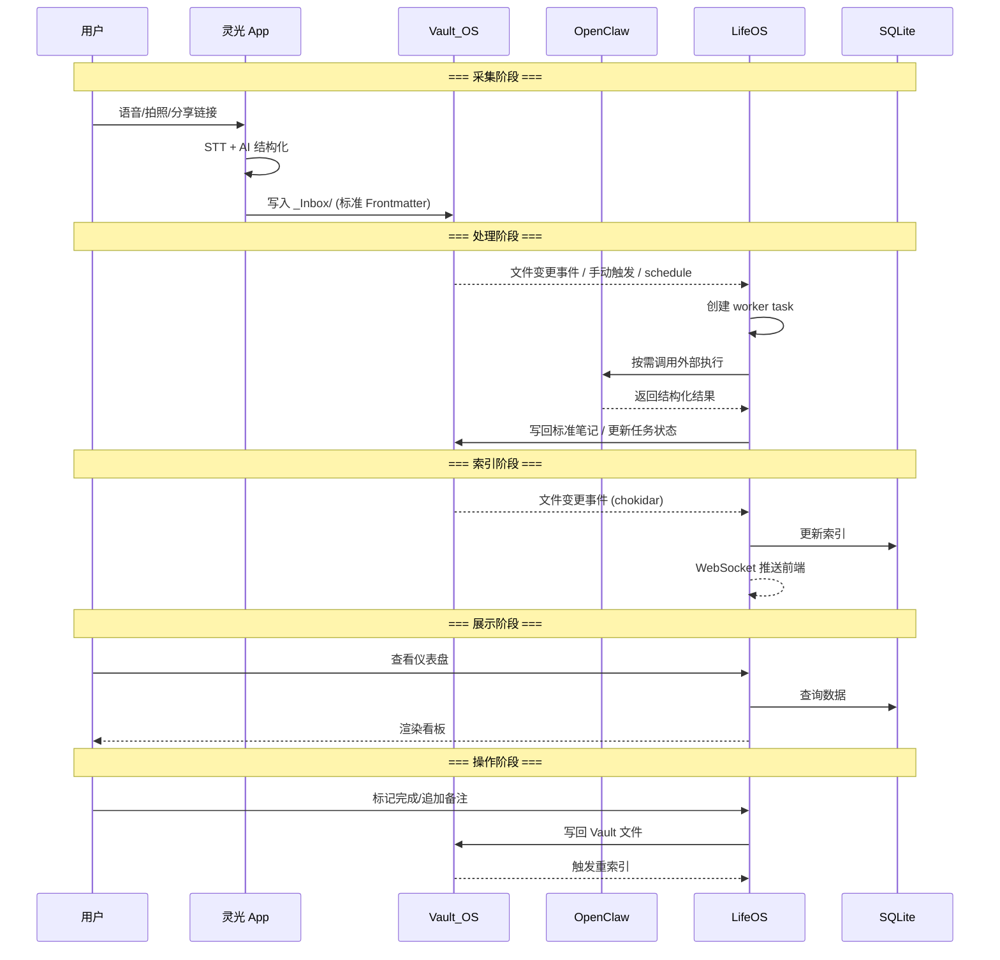

# 数据流设计

*版本: 1.0 | 更新: 2026-03-17*

---

## 全局数据流



---

## 六条核心数据通路

### 通路 1: 灵光采集
```
用户操作 → 灵光App → AI处理 → 标准Frontmatter → Vault_OS/_Inbox/
```
- 触发: 用户语音/拍照/分享
- 关键: 灵光端输出必须符合统一 Frontmatter 协议
- `type` 由 VoiceNoteType 映射确定
- `dimension` 默认填 `_inbox`，后续由 LifeOS worker task 统一处理
- `source: lingguang`

### 通路 2: LifeOS 自动化处理
```
Vault_OS/_Inbox/ → LifeOS 创建 worker task → 内部处理或调用 OpenClaw → 写回 Vault_OS/
```
- 触发: 手动入口、schedule、或后续统一自动化策略
- 操作: 由 LifeOS 读取待处理笔记，创建可追踪 worker task，执行分类/摘要/外部任务等流程
- OpenClaw 仅在需要外部执行能力时被调用，不再作为 `_Inbox` 常驻扫描主路径

### 通路 3: 实时索引
```
Vault_OS 文件变更 → chokidar 监听 → SQLite 更新 → WebSocket 推送
```
- 触发: 文件创建/修改/删除
- 延迟: ~300ms
- 去抖: 同一文件 300ms 内多次变更合并为一次

### 通路 4: 看板展示
```
SQLite → LifeOS API → Vue 3 前端 → 仪表盘/时间线/日历/维度
```
- 触发: 用户访问页面 或 WebSocket 推送新数据
- 只读操作，不修改 Vault

### 通路 5: 双向写回
```
用户操作 → LifeOS API → 修改 Vault 文件 → 触发重索引
```
- 触发: 用户在看板上标记完成、追加备注、创建笔记等
- 写操作直接修改 Vault 中的 Markdown 文件

### 通路 6: 外部执行
```
LifeOS worker task → 调用 OpenClaw → 执行 → 结果返回 LifeOS → 写入 Vault
```
- 触发: LifeOS 内部任务需要外部执行能力时
- 示例: "收集今日5篇热门微博" → LifeOS 创建任务 → OpenClaw 爬取 → LifeOS 生成结果笔记并更新任务状态
- 最终业务结果由 LifeOS 统一写回 Vault，而不是由 OpenClaw 直接作为主流程落地

---

## 冲突处理

### 可能的冲突场景
1. 用户在 LifeOS 看板修改文件，同时 OpenClaw 也在处理同一文件
2. 多设备 Syncthing 同步产生冲突文件

### 处理策略
- **任务边界**: 由 LifeOS 统一持有任务状态与落盘职责，避免外部执行直接修改最终业务结果
- **时间戳优先**: `updated` 字段记录最后修改时间，以最新为准
- **Syncthing 冲突**: Syncthing 自动创建 `.sync-conflict` 文件，不会覆盖原文件
