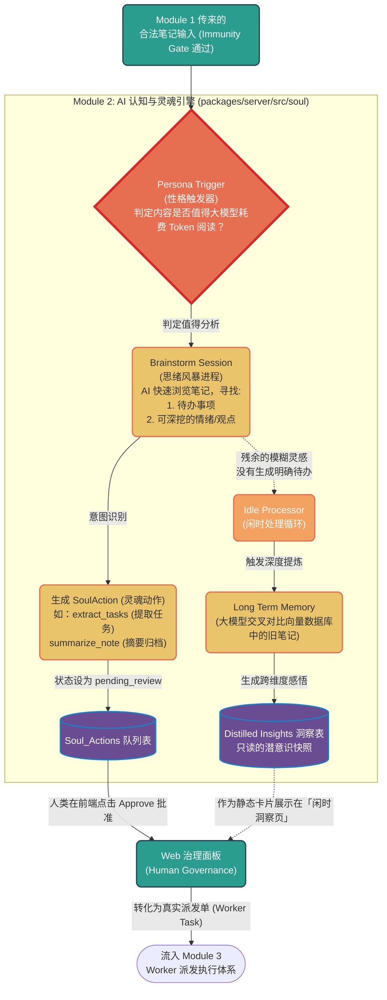

# 模块二：Soul AI认知与灵魂引擎 (Cognitive Engine)

该模块是 LifeOS 真正的“大脑”。从 Indexer 收到的结构化文本将在这里**被大模型阅读、理解、产生联想、最后转化为能够行动的真实任务派发单**。

## 核心代码文件导航 (建议依次阅读)

1. **`postIndexPersonaTrigger.ts`** (神经反射弧)
   - 当上一模块 Indexer 保存好笔记后，此函数会被调用。它会快速通过一套正则或轻量级规则（比如判断文档长度、关键词），决定要不要拉起昂贵的 LLM（大语言模型）进行进一步分析。
2. **`brainstormSessions.ts`** (头脑风暴室)
   - 它是机器第一次真正“阅读”您笔记的地方。大模型会通读这篇新进来的文章，提取出“建议动作”。比如 AI 觉得这篇文章里有几件未办事宜，它就会立刻创建一张类型为 `extract_tasks` 的 **SoulAction** 审批卡，等待您发落（Approve）。
3. **`soulActionTypes.ts` / `soulActionGovernance.ts`** (动作议会)
   - 定义了 AI 可以对您的知识库施加的指令类型（比如总结文档、提取知识点、发散联想、或者直接交给 OpenClaw 去做外部操作）。
   - 这是机器认知向现实物理世界投射前，最后也是**最重要的“人类把关”环节**。
4. **`idleProcessor.ts` & `longTermMemory.ts`** (潜意识织梦者)
   - 不是所有的笔记都有明确的待办事宜。那些零碎的随想、情绪、或者长篇大论，会被暂时休眠。当系统处于闲置状态没被高频访问时，`idleProcessor` 会悄悄爬起来，利用 1536 维的向量数据库找出相似的历史笔记，喂给大模型做深度对比，最终凝结成一条神不知鬼不觉的**“闲时洞察 (Distilled Insights)”**。
