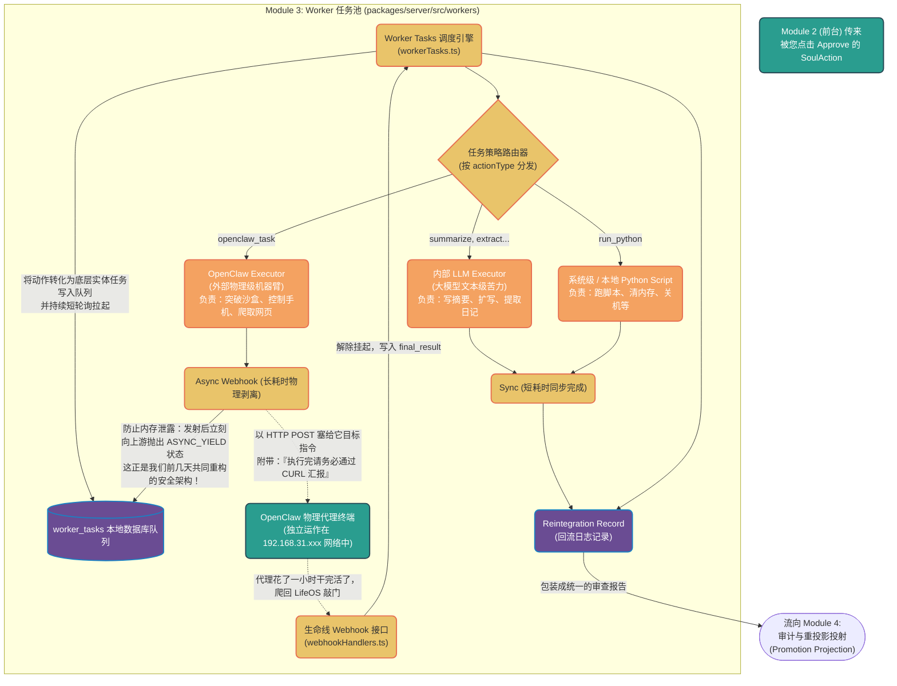

# 模块三：Worker 异步执行生态 (Execution Engine)

这是系统的**肌肉框架**。前两层（Indexer 和 Soul）只负责“思考能干什么”，但所有的“苦力活”和“外部环境交互”全都在这个模块里进行分流、排队、调度和容错。

## 核心代码文件导航 (建议依次阅读)

1. **`workerTasks.ts`** (黑工头包工队)
   - 这是个死循环监听器！只要表 `worker_tasks` 里有没干完的活，它就会根据排队顺序拉起来分配。
   - 重点看里面的 `ASYNC_YIELD` 逻辑（咱们刚修好的异步回调机制）。传统系统中，如果让 Node.js 同步等待 OpenClaw 操作手机一个多小时，服务器内存就会被撑爆或者超时。这里的处理非常优雅：交出任务后，立马将状态挂起休眠（yield）。
2. **`executors/llmExecutor.ts`** (办公室文员)
   - 这个文件负责所有本服大模型擅长的脏活累活。它会把要阅读的文档拼接到一处，然后调用 `callClaude`。
   - 之前在 `PromotionProjectionPanel.vue` 您看到的那些“原始长文日志”，大部分就是这家伙不加修饰吐出来的提取结果。
3. **`executors/openclawExecutor.ts`** (外派特种兵)
   - 专门用于呼叫 OpenClaw 的封装器。
   - **它包含了一个极其精妙的文件转移设计**：由于 OpenClaw 是运行在别处的隔离环境，当它帮您生成了一份文件（比如网页长截图、汇总报表），它是没法放到 LifeOS Vault 里的。我们设计它把资源作为 Payload 传回来后，LifeOS 用底层的权限将那几个文件复制粘贴进 `assets/` 物理文件夹，并自动生成双链（`![[file]]`）挂到回流报告中。
4. **`webhookHandlers.ts`** (传达室保安)
   - 它其实是在 `api` 层，但和 Worker 命脉相连。暴露了一个公网或局域网 HTTP POST 接口 `openclaw-callback`。这就是 OpenClaw 干完活之后“打电话报平安”的热线，它接收到电话后，会把 Worker Task 的悬念给完结掉。
