# 模块四：Governance 治理与重投射 (Promotion Pipeline)

这里是数据在系统的最后一站。Worker（打工人）干完活交上来的报告（Reintegration Record 机器回流记录），将在这里迎接**人类的最终审视**。系统会根据 PR6 (Promotion Rule 6) 规范，决定这些虚幻的文本报告是否能“晋升”为现实世界中具体的事件实体。

```mermaid
graph TD
    %% 样式定义
    classDef External fill:#2a9d8f,stroke:#264653,color:#fff,stroke-width:2px,rx:8px,ry:8px;
    classDef Core fill:#e9c46a,stroke:#e76f51,color:#333,stroke-width:2px,rx:8px,ry:8px;
    classDef Database fill:#6a4c93,stroke:#1982c4,color:#fff,stroke-width:2px,rx:8px,ry:8px;
    classDef Trigger fill:#e76f51,stroke:#d62828,color:#fff,stroke-width:4px,rx:8px,ry:8px;
    classDef UI fill:#8338ec,stroke:#3a0ca3,color:#fff,stroke-width:2px,rx:8px,ry:8px;

    A("Module 3 (Worker层) 产出的\nReintegration Record (回流报告)\n初始状态: pending_review"):::External

    subgraph Gov模块 ["Module 4: 治理与重投射 (Governance & Promotion)"]
        
        %% 第二道人类门控
        B{"二次人类审核\n(Reintegration Review)"}:::Trigger
        A -->|"人类在前端点击 Accept (接受这份报告)"| B
        A -.->|"Reject 或 发现报错 / 拒绝提议"| Z([丢弃此报告，可手动重试])
        
        %% PR6 矩阵
        C("PR6 晋升规则生成器\n(reintegrationPromotionPlanner.ts)"):::Core
        B -->|"系统自动调用 getSuggestedSoulActionKinds"| C
        
        %% 信号判定
        D{"Signal Kind 判断矩阵\n(这份回流报告是什么类型？)"}:::Core
        C --> D
        
        %% 分支流向
        E("【无下游需要】\n(如：单纯的归档、总结、外部网页网页摘取)"):::Core
        F("【强行动力型】\n(如：AI 从杂记中精准提取出的明确待办)"):::Core
        G("【长时生命感悟型】\n(如：每日复盘、每周周报、宏观人格快照)"):::Core
        
        D -->|summarize_reintegration\nopenclaw_reintegration| E
        D -->|task_extraction...| F
        D -->|daily_report...\npersona_snapshot...| G
        
        %% 终止
        E -.->|"流程自动在此完美终止\n（由于无下游需生成，此时点击 Web 界面的\n『手动补规划』按钮不会再产生任何新事务）"| END([静默归档入库备查])
        
        %% 衍生新一轮实体
        H("再衍生一张 SoulAction 派发单\n(指令: create_event_node)"):::Database
        I("再衍生一张 SoulAction 派发单\n(指令: promote_continuity_record)"):::Database
        
        F --> H
        G --> I
        
        %% 最终实体落地
        J("具象化 Event Node (事件节点)\n明确附带: DDL时间、阈值、执行状态\n如: '明天下午3点开会'"):::Database
        K("具象化 Continuity Record (连续性记录)\n附带: 强度定位、跨岁月指向\n如: '检测到本周主旋律为 [职业焦虑]'"):::Database
        
        H -->|"再次无缝滑过前三层架构"| J
        I -->|"再次无缝滑过前三层架构"| K
        
        %% 前端可视化审计
        L("投射渲染引擎面板\n(PromotionProjectionPanel.vue)\n以极简的 UI 胶囊封装晦涩的技术溯源 (UUID/JSON证据)，优雅地向人类展示成果。"):::UI
        J --> L
        K --> L
    end
```

## 核心代码文件导航 (建议依次阅读)

1. **`reintegrationTypes.ts`** (PR6 矩阵法典)
   - 之前阻碍您“手动补规划”按钮生效的逻辑就在这个文件里（`getSuggestedSoulActionKindsForReintegrationSignal` 函数）。
   - 它像一张法律判决对照表：规定了什么类型的回流报告（比如提取任务），必须无休止地继续生成下一步动作（创建事件节点）；什么样的报告（比如执行普通的 OpenClaw 抓取）到底为止不再衍生。
2. **`reintegrationPromotionPlanner.ts`** (晋升规划师)
   - 接收人类的 `Accept` 动作后，它根据法典（上方的矩阵），把“大模型的一堆乱码文字（Raw JSON）”，揉捏排版成下一代标准的、规范的 `SoulAction` 或直接派生出终极节点。
3. **`components/ReintegrationReviewPanel.vue`** (审阅台)
   - 这也是 **AI -> 人类** 整个流程里的 **“第二道人工门控”**。
   - 第一道在 Module 2 (审批 AI 要不要去读笔记)；第二道就是在这里 (审批 AI 读完记笔记后给出的干货成果靠不靠谱)。如果不靠谱，我们可以在这个阶段把荒谬的结论 Reject 拦截在外。
4. **`components/PromotionProjectionPanel.vue`** (终极投射画廊)
   - 这正是我们刚刚重构完的前端界面。这个面板没有任何后台逻辑处理能力，它纯粹是个“博物馆”，将所有已经化为实体（Event Node / Continuity Record）的人生切片罗列在一起。
   - 这也是 LifeOS 把一串含糊不清的中文语句（“我好想去旅游”），最终雕刻成一个具备“发生时间”、“优先级”、“大模型溯源原因”的精准物理动作的最后一步。
