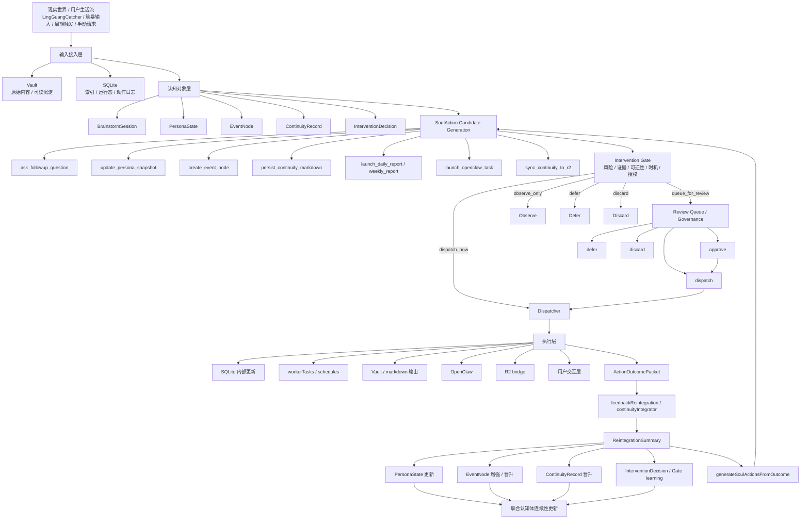
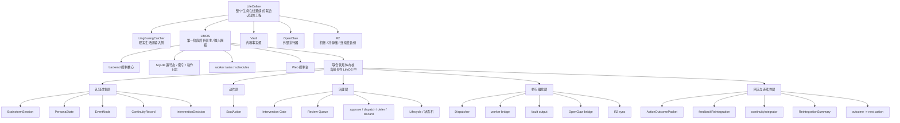

# LifeOnline 第一阶段控制流程图、组织架构图与开发主线（开箱即用版）

## 一、文稿定位

这份文稿不是新的愿景草案，也不是替代 `vision/00-权威基线` 的顶层基线。

它的作用只有一个：

> 把当前已经对齐清楚的项目定位、控制流程、组织架构、开发路线、开发节奏，以及后续最该优先推进的主线，整理成一份可以直接复用的“开箱即用版”说明。

适用场景：
- 新一轮连续开发 worker 启动前快速对齐
- 你我之后继续讨论“现在在主线吗”时快速统一口径
- 后续判断某个改动是增强联合认知体骨架，还是只是在修工具表面
- 给未来的控制台、API、治理面和回流层设计提供总底图

---

## 二、项目定位（统一口径）

### 1. LifeOnline 是什么

`LifeOnline` 不是一个普通 web app，也不是一套单纯的 AI 自动化工具。

它的目标是：

> 构建一个可持续、可治理、可回流、可跨时间延续的人机联合认知体。

它关心的不是“这次回答漂不漂亮”，而是：
- 这次输入有没有被真正理解
- 这次动作有没有被正式治理
- 这次执行结果有没有被系统吸收
- 这次结果是否形成了未来可继承的连续性资产

### 2. 几个关键名词的边界

#### LifeOnline
- 整个工程总名
- 表达的是“生命的在线延续”
- 是联合认知体的总工程，不等于单个子系统

#### LingGuangCatcher
- 现实生活流输入侧
- 是灵感、脑暴、日常行为信号进入系统的主入口之一

#### LifeOS
- 第一阶段后台宿主与输出展板
- 是控制核心、运行态宿主、worker/schedule 编排中枢、Web 控制台所在
- **不是整个项目本身**
- 当前联合认知体内核在工程上长在这里

#### Vault
- 内容事实源
- 承担 markdown / frontmatter / 可读沉淀 / 人机共读层

#### OpenClaw
- 外部执行器
- 是“手脚”，不是“主脑”

#### R2
- 桥接 / 冷存储 / 连续性备份基础设施
- 是“桥”，不是“主存”

### 3. 第一阶段的真正目标

第一阶段的目标不是完全自治，也不是先把所有对象、页面、自动化都做满。

第一阶段要先长出一个：

> 最小但真实、可治理、可持续演进的联合认知运行态。

最小闭环应是：

```text
输入
  -> 理解
  -> 动作候选
  -> Gate / Review / Dispatch
  -> 执行
  -> 结果
  -> Reintegration
  -> 连续性更新 / 下一轮候选
```

---

## 三、控制流程图（Mermaid）

下面这张图描述的是第一阶段的正式主线：



### 这张图真正表达的东西

这条主线里最关键的，不是“执行动作”本身，而是：

1. **动作必须先成为正式对象**
   - 不是零散业务分支
   - 而是 `SoulAction`

2. **动作必须先经过治理**
   - 不是一有想法就自动做
   - 而是 `Gate / Review / Dispatch`

3. **结果不能只停在日志里**
   - 不是做完就结束
   - 而是进入 `ActionOutcomePacket -> ReintegrationSummary`

4. **系统要能通过结果继续塑造自己**
   - 这才是联合认知体和普通自动化系统的区别

---

## 四、组织架构图（Mermaid）

下面这张图描述的是系统层级关系：



### 这张图真正表达的东西

#### 1. LifeOS 是宿主，不是项目本体
后续任何开发判断都不能把 LifeOS 当成整个项目。

更准确的说法是：

> 在 LifeOS 这个后台宿主里，实现服务于整个 LifeOnline 的联合认知体内核。

#### 2. 联合认知体内核有五层
第一阶段最关键的不是页面数，而是这五层是否在长：

1. 认知对象层
2. 动作层
3. 治理层
4. 执行编排层
5. 回流与连续性层

#### 3. 页面和 API 都应该服务这五层
后续 Web 控制面、API 设计、review queue、detail 页面，都应该围着这五层转，
而不是继续围着普通 dashboard 卡片思维转。

---

## 五、当前代码库到这两张图的映射

本节用于帮助后续快速判断：当前真实工程在哪里、哪些层已经有锚点、哪些还在骨架阶段。

### 1. 输入接入层
当前较成熟，主要宿主在：
- `LifeOS/packages/server/src/vault/*`
- `LifeOS/packages/server/src/db/*`
- indexing / notes / reindex 相关链路

当前更大的缺口不在“输入进不来”，而在：
- 输入是否进入认知对象层
- 后续动作是否正式治理
- 结果是否真正回流

### 2. 认知对象层
vision 已明确的对象包括：
- `BrainstormSession`
- `PersonaState`
- `EventNode`
- `ContinuityRecord`
- `InterventionDecision`

当前状态应理解为：
- **语义已经明确**
- **部分最小骨架已经存在**
- **但仍未形成完整产品化运行态主线**

### 3. 动作层（SoulAction）
这是当前第一阶段主线中轴之一。

关键真实区域在：
- `LifeOS/packages/server/src/soul/*`

当前应理解为：
- PR1 最小骨架已存在
- PR2 / PR3 最小闭环已有保守落地
- 但覆盖仍窄、产品化控制面仍弱

### 4. 治理层（Gate / Review / Dispatch）
关键模块与宿主在：
- `LifeOS/packages/server/src/soul/interventionGate.ts`
- `LifeOS/packages/server/src/soul/soulActionDispatcher.ts`
- `LifeOS/packages/server/src/api/*`
- `LifeOS/packages/web/*` 中未来的治理面

当前状态应理解为：
- 最小治理链已开始形成
- review/governance 语义已有落点
- 但还没成为真正的第一等控制中枢

### 5. 执行编排层
关键宿主在：
- `LifeOS/packages/server/src/workers/workerTasks.ts`
- `LifeOS/packages/server/src/workers/taskScheduler.ts`
- Vault / OpenClaw / R2 bridge 相关路径

当前这层较成熟，但问题不是“不会执行”，而是：
- 是否被联合认知体正确接管
- 执行前有没有治理
- 执行后有没有回流

### 6. 回流与连续性层
这是当前最关键的深水区之一。

关键模块在：
- `LifeOS/packages/server/src/workers/feedbackReintegration.ts`
- `LifeOS/packages/server/src/workers/continuityIntegrator.ts`
- `LifeOS/packages/server/src/soul/reintegrationOutcome.ts`
- `LifeOS/packages/server/src/soul/reintegrationReview.ts`
- `LifeOS/packages/server/src/soul/reintegrationPromotionPlanner.ts`
- `LifeOS/packages/server/src/soul/pr6PromotionRules.ts`
- `LifeOS/packages/shared/src/types.ts`

当前状态应理解为：
- PR4 最小 skeleton 已落地
- PR5 / PR6 在保守口径下已有最小真实推进
- outcome / summary / evidence / record input / shared contract 正在收口
- 但真正产品化的 continuity / promotion / governance 控制面仍未完成

---

## 六、开发路线（负责人视角）

### 总原则
后续开发不是“看哪里还能补”，而是按以下总路线推进：

1. 先让 **动作可见**
2. 再让 **治理可见**
3. 再让 **结果可见**
4. 再让 **回流可见**
5. 最后让 **连续性晋升可治理**

### 不该优先做的事
默认不再把以下内容当成主线成果：
- dashboard/stats/panel 的 copy 中文化
- header / badge / eyebrow / label / hint 的对称收边
- 不影响认知、治理、连续性、事实源或主路径行为的表层 polish

除非这些问题直接暴露了更深层：
- contract gap
- fact-source 问题
- governance 语义错误
- 主路径行为断裂

---

## 七、当前最该优先推进的 5 条主线（P1~P5）

这是后续判断“现在是不是在主线上”的默认优先级框架。

### P1｜SoulAction 总览页 / Review Queue
目标：把 `soul_actions` 正式变成联合认知体的一等治理对象。

最低期望：
- 列表接口稳定
- review queue 可见
- 可以区分 pending review / approved waiting dispatch / running / completed / failed / deferred / discarded

### P2｜SoulAction Detail / Lifecycle View
目标：让单条动作成为可审计对象。

最低期望：
- source
- reason
- governance
- execution
- outcome
- reintegration
- next action

都能在 detail 面中看清。

### P3｜Governance API 收口
目标：把 `approve / dispatch / defer / discard` 从零散 handler 收成正式治理协议。

关键要求：
- `approve != dispatch`
- defer / discard 支持治理理由
- lifecycle / approval / execution 语义分层清楚

### P4｜ActionOutcomePacket + ReintegrationSummary 最小闭环
目标：把执行结果正式变成可回流对象。

关键要求：
- `ActionOutcomePacket`
- `ReintegrationSummary`
- packet -> summary -> evidence -> record input
- outcome -> next action 的真实闭环入口

### P5｜Continuity Promotion Review / Evidence 面
目标：让 `ContinuityRecord` 晋升成为有证据链、有治理路径的正式系统能力。

关键要求：
- promotion source
- evidence summary
- review status
- linked outcome / linked event / linked persona signal
- continuity promotion review / evidence 面

---

## 八、开发节奏（统一执行节奏）

### 1. 先看主线，不先看提交数
后续判断“有没有进展”，优先看：
- 是否更接近 P1~P5
- 是否更接近 PR1–PR6 主线
- 是否更接近“输入 -> 理解 -> 动作 -> 治理 -> 执行 -> 回流 -> 连续性”

而不是只看：
- 又多了几个 commit
- 又修了几个页面文案

### 2. 先收底层 contract，再做控制面
对当前阶段来说，合理顺序通常是：
- 先收口 outcome / summary / evidence / shared contract
- 再投射到 API / web 控制面

### 3. 优先做“系统长骨架”的工作
优先级判断标准：

> 这项改动是在增强联合认知体骨架，还是只是在修工具表面？

如果偏后者，默认放弃。

### 4. 汇报节奏默认按 P1~P5
后续进展汇报，默认按 P1~P5 讲，而不是只报 commit 流水账。

---

## 九、对 gstack 的吸收口径（避免学偏）

近期讨论过 `gstack`，这里固定一版结论，避免后续再次漂移。

### 值得学的
- 角色边界
- 流程顺序
- 交接物标准化
- review / QA / release 的制度化思维
- 让 agent 在制度里工作，而不是无限自由发挥

### 不该学偏的
- 不要把 LifeOnline 收缩成“软件工厂”
- 不要把角色 prompt 当成系统能力本身
- 不要用文档代替正式运行态对象
- 不要把产能提升当成唯一北极星

### LifeOnline 的正确吸收方式
LifeOnline 可以吸收 gstack 在“组织 agent 工作流”上的强项，
但项目本体仍必须是：

> 联合认知体 / 连续性 / 治理 / 回流 / 认知运行态

而不是单纯的软件生产系统。

---

## 十、后续使用方式（强建议）

### 1. 启动 worker 前先读本文件
尤其是在连续开发 worker 刚重启、换 prompt、换阶段时。

### 2. 每次判断进展时，先定位到五层骨架
先问：
- 这次改动属于认知对象层、动作层、治理层、执行编排层，还是回流与连续性层？

### 3. 每次汇报时，先定位到 P1~P5
先回答：
- 这次推进了哪一条优先级？
- 哪条主线因此更完整了？

### 4. 页面和 API 的设计都要回看这两张图
后续所有控制台、review queue、detail 页、promotion 面、dashboard 改造，
都应该回看：
- 控制流程图
- 组织架构图

如果解释不了自己在这两张图中的位置，通常说明它不够主线。

---

## 十一、一句话收束

> LifeOnline 第一阶段不是在做一个更漂亮的 LifeOS 控制台，而是在 LifeOS 这个宿主中，把联合认知体的五层骨架做实：认知对象层、动作层、治理层、执行编排层、回流与连续性层；后续所有开发都应优先服务这条主线，而不是继续滑回普通 web 工具项目的表层修补。
---

## 十二、当前阶段总结（2026-03-24 代码级检视版）

### 1. 当前总判断

截至 2026-03-24 代码级检视，项目已完成五个方向的实质推进：

> **方向 A**：SoulAction 覆盖面从 5 种扩展到 11 种 actionKind（含 Vault 写入 + R2 同步）。**方向 B**：Web 治理面板增强（含 BrainstormSession 面板、SoulAction Detail 页面）。**方向 C**：systemd 部署运维闭环建立。**方向 D**：蓝图 5 个认知对象全部全栈实现。**方向 E**：SoulActionKind 类型统一已完成（shared 定义 + server re-export）。

`src/soul/` 已有 18 个模块文件，schema 含 12 张表，PR1–PR6 全链路均有最小真实落地，11 种 actionKind 全部有 dispatcher 实现。

### 2. 当前 P1~P5 状态

| 主线 | 状态 | 判断 |
|---|---|---|
| P1 SoulAction 治理面 | 已可用 | GovernanceView 含四个面板 + SoulActionDetailView 独立页面 |
| P2 Detail / Lifecycle | 已落地 | SoulActionDetailView.vue 21KB 完整页面 |
| P3 Governance API | 已落地 | approve / dispatch / defer / discard 分离 + answerFollowup |
| P4 Outcome / Reintegration | 已落地 | outcome → summary → evidence → record → promotion 全链路 |
| P5 Continuity Promotion | 最小落地 | review-backed promotion + PromotionProjectionPanel |

### 3. 当前主线方向（三组并行）

| 组 | 方向 | P1 任务 |
|---|---|---|
| 🔵 A 组（认知深化） | BrainstormSession distilled + 连续性增强 | BrainstormSession 深度提炼 |
| 🟢 B 组（治理产品化） | GovernanceView 拆分 + Detail 增强 | GovernanceView 组件拆分（44KB→<20KB） |
| 🔴 C 组（基础设施） | R2 验证 + 测试覆盖 | R2 凭据配置与端到端验证 |

### 4. 一句话总结

> SoulAction 覆盖面从 2 → 11 种 actionKind，soul 模块从 2 → 18 个文件，schema 含 12 张表，蓝图 5 个认知对象全部全栈实现，SoulActionKind 类型统一已完成，SoulAction Detail 独立页面已落地；后续以三组并行模式推进认知深化、治理产品化与基础设施稳定性。

